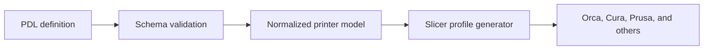

# Printer Definition Language

PDL is an open YAML/JSON format for describing a 3D printer independently of
any one slicer. It captures machine geometry, firmware, toolheads, material
capabilities, process defaults, and reusable G-code hooks.

## What it enables

- Share printer definitions as readable, version-controlled files.
- Validate definitions before importing or generating profiles.
- Generate configurations for multiple slicers from one source.
- Build community-maintained printer definitions without opaque GUI exports.

## Data flow

## Start here

1. Read the [getting-started guide](getting-started.md).
2. Copy the [minimal example](examples/minimal.yaml).
3. Validate it against the [PDL schema](schema/pdl.schema.json).
4. Consult the [complete specification](PDL_SPEC.md) when adding capabilities.

The [OpenPrintKit](https://github.com/Monotoba/OpenPrintKit) project provides a
reference validator and slicer-profile generators for PDL.
